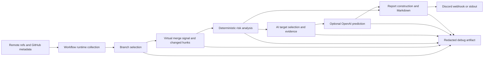
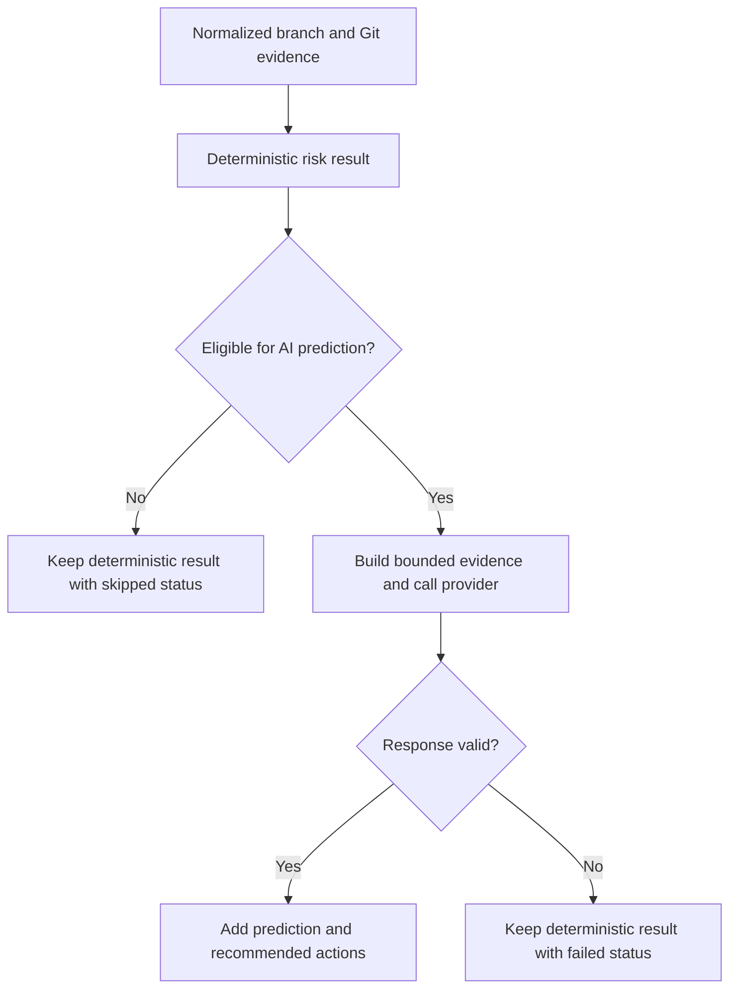

# Watcher Architecture Rules

## Purpose

This reference defines Watcher-specific ownership, data flow, and external-service boundaries for AI-assisted architecture work.

The goal is not to let an AI invent new product policy. The goal is to stop before changing deterministic risk results, public workflow contracts, secret handling, or release behavior without an explicit owner decision.

Use this reference with `AGENTS.md`, `.agents/rules/general.md`, and `.agents/roles.md`.

Watcher is a standalone TypeScript/Node automation repository. `package.json`, `tsconfig.json`, `README.md`, `.github/workflows/*`, and the current source and tests are the local source of truth.

## When to use

Read this file before work that changes any of these areas:

- Ownership or dependency direction across `src/branches`, `src/git`, `src/risks`, `src/ai`, `src/reports`, `src/reportChannels`, `src/debug`, or `src/workflows`.
- Deterministic branch selection, merge signals, risk scores, statuses, reasons, or report results.
- OpenAI target selection, prompt construction, response validation, failure isolation, or provider batching.
- GitHub, OpenAI, Discord, filesystem, environment-variable, or child-process boundaries.
- Reusable workflow inputs, secrets, permissions, source resolution, debug artifacts, or release packaging.
- Public exports from `src/index.ts`, shared contracts, or README architecture explanations.

Before editing, also read `README.md`, `package.json`, `tsconfig.json`, and the relevant `.github/workflows/*` files. Then inspect the concrete source files and tests related to the requested change.

## Mandatory flow

1. Identify the owning module and public contract before editing.
2. Trace the current input, transformation, output, and external effects.
3. Classify the change as mechanical, behavioral, architectural, or ambiguous.
4. Stop and ask the user before changing deterministic results, public workflow contracts, secret handling, or release contents when the requested behavior is ambiguous.
5. Keep the diff limited to the requested ownership boundary.
6. Follow `.agents/rules/project-workflows.md` for verification.
7. Report changed files, boundary decisions, verification results, and unresolved owner decisions.

## Safe mechanical changes

These may proceed after inspection when they do not change observable results or public contracts:

- Removing unused imports or unreachable private helpers.
- Updating imports after an already-approved file move.
- Updating tests and documentation to match an already-approved contract.
- Renaming private symbols without changing serialized output, environment keys, workflow inputs, or report wording.

## High-level data flow



## Module ownership

| Module | Owns | Ask before |
| --- | --- | --- |
| `src/branches` | Branch, check, and PR metadata contracts plus base/default exclusion and branch selection | Adding Git execution, risk analysis, report formatting, or provider calls |
| `src/git` | Branch fetch, merge-base, virtual merge, changed-file, conflict-file, and merge-failure signals | Moving hunk parsing, GitHub metadata, product risk policy, or report text into this module |
| `src/risks` | Deterministic score, status, reason, overlap, and precedence policy | Changing score values, thresholds, precedence, or same-input results |
| `src/ai` | AI target selection, evidence shaping, prompt construction, provider call, response validation, and branch failure isolation | Replacing deterministic results, sending broader source data, changing provider contract, or exposing unvalidated responses |
| `src/reports` | Provider-neutral report model construction and Markdown formatting | Adding transport behavior or leaking internal-only evidence |
| `src/reportChannels` | Report delivery, Discord chunking, stdout fallback, and transport error redaction | Adding a new channel or changing secret and failure behavior |
| `src/debug` | Optional redacted diagnostic artifacts | Adding secrets, raw file contents, raw diffs, or unbounded provider data |
| `src/workflows` | Environment parsing, remote-ref listing, GitHub check and PR metadata collection, diff-hunk parsing, runtime orchestration, and delivery failure propagation | Adding deterministic score policy, AI response policy, report formatting, or channel transport policy |
| `src/index.ts` | Deliberate public exports | Expanding the public contract without consumer impact review |

## Boundary rules

- Keep branch discovery and selection independent from risk scoring.
- Keep Git signal collection independent from product score policy.
- Keep deterministic results reproducible for the same normalized input.
- Keep AI prediction additive. Provider output must not erase or rewrite deterministic possibility results.
- Select AI targets from deterministic results and skip confirmed conflicts when the current policy requires no provider call.
- Validate provider responses before mapping them into reports.
- Isolate provider failure by branch and retain deterministic reporting.
- Keep report construction independent from Discord delivery.
- Keep debug output optional, redacted, and bounded.
- Preserve the current `src/workflows/mergeRiskWatch.ts` ownership of remote-ref listing, GitHub metadata collection, hunk parsing, and pipeline composition. Do not add deterministic score, AI response, report formatting, or report channel policy there.

## Deterministic and AI decision boundary



Do not let provider output change deterministic scores, statuses, or reasons unless the user explicitly approves a product-contract change and the tests and README are updated together.

## External service boundaries

- GitHub access belongs at branch and Git metadata collection or workflow orchestration boundaries.
- OpenAI access belongs behind `openAiPredictionClient` and `predictionRunner`; prompt and response contracts remain separately testable.
- Discord access belongs behind the report channel abstraction; missing `DISCORD_WEBHOOK_URL` preserves stdout fallback.
- Tests must replace external providers and report channels with fakes or injected functions and must not call live services.
- Error messages and debug artifacts must not expose credentials or webhook URLs.
- Do not add new outbound data fields without checking data minimization and debug artifact impact.

## Reusable workflow boundary

- `.github/workflows/merge-risk-watch.yml` is a consumer-facing API.
- Preserve documented `workflow_call` inputs, secret names, defaults, permissions, and source-resolution behavior unless the task explicitly changes that contract.
- Keep consumer secret names distinct from runtime environment-variable names where the workflow maps them deliberately.
- Tag references use the matching release asset; branch and SHA references use source checkout, `npm ci`, and `npm run build`.
- `upload_debug_artifact` must remain opt-in and upload only the redacted artifact directory.

## CI and release boundary

- `.github/workflows/ci.yml` runs on pull requests and owns build/test validation and failure reporting.
- `.github/workflows/release.yml` is a manual semantic-version release path that builds, tests, packages `package.json` and `dist/src`, tags, and creates a GitHub Release.
- Do not change action versions, permissions, triggers, packaging contents, tag behavior, or release asset naming as incidental cleanup.
- `dist/` and `watcher-deploy.tar.gz` are generated outputs and must not be committed.

## Processing and import direction

The runtime processing order is:

```text
workflow collection -> branch selection -> virtual merge and hunk evidence -> risks -> AI assistance -> reports -> report channel
workflow orchestration writes optional debug artifacts throughout the run
```

This processing order is not the TypeScript import direction. Preserve the current source dependency shape unless the user approves an ownership change:

```text
git -> branches
risks -> branches, git
ai -> branches, git, risks
reports -> branches, risks, ai
workflows -> branches, git, risks, ai, reports, reportChannels, debug
```

`reportChannels` and `debug` do not import analysis modules. They receive already-built values from workflow orchestration.

Shared types should stay with the module that owns their meaning. Do not create a generic shared module only because multiple modules import a type.

## Ambiguity gate

Stop and ask the user before editing when any of these decisions are not already fixed by the request or current repository contract:

- A score, threshold, signal precedence, branch exclusion, or report status changes.
- AI becomes authoritative over deterministic results.
- Additional source, diff, PR, check, prompt, response, or secret data leaves the process or enters debug artifacts.
- A reusable workflow input, secret, permission, default, trigger, or release resolution rule changes.
- A public export, report schema, release asset, environment key, or documented consumer example changes.
- A build fix requires weakening strict TypeScript, test isolation, secret redaction, or failure isolation.
- The change expands beyond the current issue or task scope.
